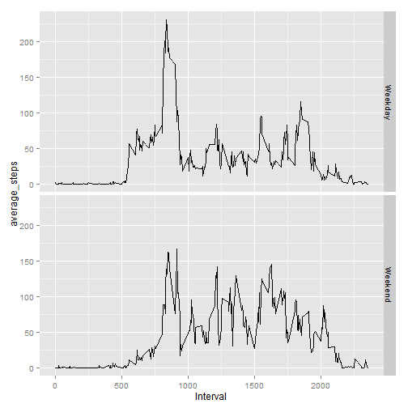

##Loading and Preprocessing Data


```r
mydata <- read.csv("activity.csv",header=TRUE)

cleandata<-mydata[complete.cases(mydata),]
```

##Mean total number of steps taken per day


```r
histdata<-aggregate(cleandata$steps ~ cleandata$date, cleandata, sum)

colnames(histdata)<-c("date","steps")
hist(histdata$steps, main="Histogram of Total Daily Steps", xlab="Steps")
```

 

```r
options(digits=12)
###Mean
summary(histdata$steps)[4]
```

```
##       Mean 
## 10766.1887
```

```r
#mean(histdata$steps)

###Median
summary(histdata$steps)[3]
```

```
## Median 
##  10765
```

```r
#median(histdata$steps)
```

##Average daily activity pattern

```r
###Average Daily Activity pattern###
avgdata<-aggregate(cleandata$steps ~ cleandata$interval, cleandata, mean)
colnames(avgdata)<-c("Interval","steps")
with(avgdata, plot(Interval, steps,main="AVERAGE STEPS",
                     type = "l",
                     ylab = "Average Steps",
                     xlab = "Interval",
                     ylim = c(0,max(steps))))
```

 
##Interval with maximum avarage value

```r
####Interval with maximum value###
avgdata[which.max(avgdata$steps),]
```

```
##     Interval         steps
## 104      835 206.169811321
```

##Imputing missing values

```r
####Inputing missing values###
##Count of missing data##
length(which(is.na(mydata)))
```

```
## [1] 2304
```

```r
###Replace missing values with mean for the 5min interval###
newdata <- mydata
for(i in 1:nrow(newdata)){
    if(is.na(newdata[i,1])){
        newdata[i,1]<-avgdata[avgdata$Interval==newdata[i,3],2]
    }
}

newhistdata<-aggregate(newdata$steps ~ newdata$date, newdata, sum)

colnames(newhistdata)<-c("date","steps")
hist(newhistdata$steps, main="Histogram of Total Daily Steps", xlab="Steps")
```

 

```r
###Mean
summary(newhistdata$steps)[4]
```

```
##       Mean 
## 10766.1887
```

```r
###Median
summary(newhistdata$steps)[3]
```

```
##     Median 
## 10766.1887
```

##Are there differences in activity patterns between weekdays and weekends?


```r
####activity patterns between weekdays and weekends####
dow <- weekdays(as.Date(newdata$date),abbreviate = TRUE)
dow<-gsub("Mon|Tue|Wed|Thu|Fri","Weekday",dow)
dow<-gsub("Sat|Sun","Weekend",dow)

newdata1 <- cbind(newdata,dow)

###Turn data to datatable and group####
library(data.table)
datatable <- data.table(newdata1)
newavgdata<-datatable[, mean(steps), by = c("interval","dow")]

setnames(newavgdata,"V1","average_steps")
setnames(newavgdata,"interval","Interval")

library(ggplot2)
g<-ggplot(newavgdata,aes(Interval,average_steps))
g + geom_line() + facet_grid(dow~.)
```

 
